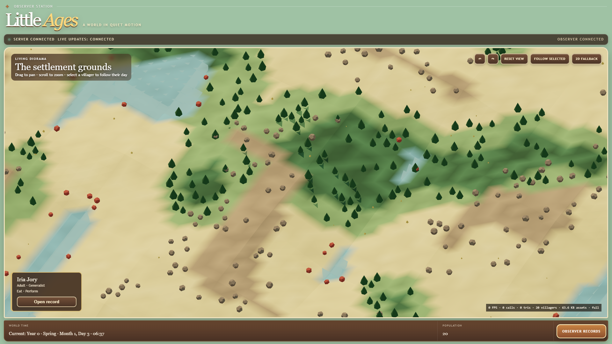
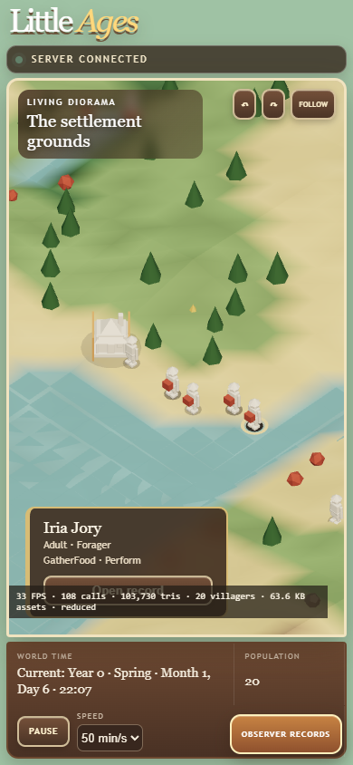
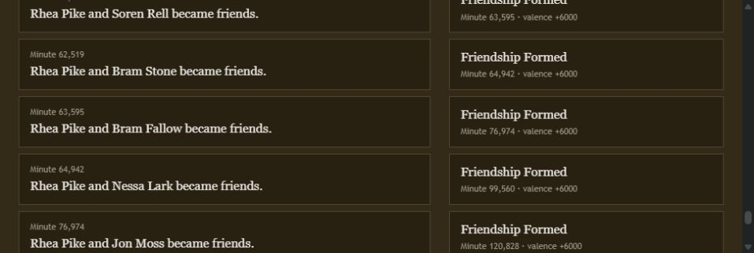
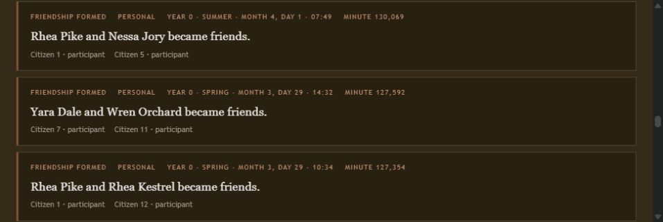
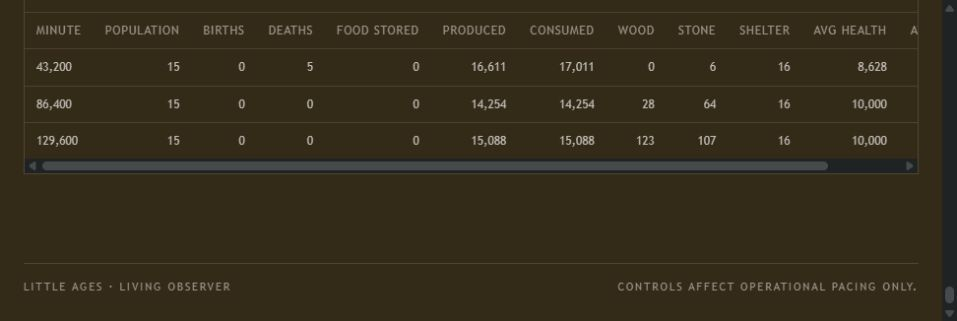

# Little Ages

[](https://github.com/joewolly/LittleAges/actions/workflows/ci.yml)
[](https://github.com/joewolly/LittleAges/releases)

**A persistent autonomous civilization simulation.** Start with a handful of
people, leave them alone, and come back later to discover what happened.

<p align="center">
  
</p>

## Overview

The opt-in [v0.2 Living Settlement expansion](docs/living-settlement-v0.2.md)
adds coordinated work, farming and production, personal lives, weather and
wildlife, and knowledge passed between generations. Existing saves retain
their original rules. See its [acceptance status](docs/living-settlement-acceptance.md)
before selecting the new rules for development.

Little Ages creates a deterministic world and lets its citizens live inside it.
They gather resources, survive changing pressures, form relationships, build a
settlement, create families, age, die, and leave behind factual history that
can be inspected long after the moment that created it.

The project is designed around a simple boundary: the simulation owns reality.
The server owns canonical state and persistence; the browser is an optional
observer and operational control surface. There is no LLM in the canonical
loop, and the UI cannot invent events or mutate gameplay state.

## See the application

These images are captures of the real observer UI running against disposable,
deterministic worlds. The scene is now the application: an orthographic
storybook diorama with route-smoothed citizens and a responsive, tabbed record
ledger instead of a scrolling document page.

<p align="center">
  
</p>
<p align="center"><sub>The same authoritative world at a 390 × 844 mobile viewport</sub></p>

<p align="center">
  
  
</p>
<p align="center"><sub>Citizen biography and memories</sub>&nbsp;&nbsp;&nbsp;&nbsp;&nbsp;&nbsp;&nbsp;&nbsp;<sub>Factual historical record</sub></p>

<p align="center">
  
</p>
<p align="center"><sub>Append-only monthly statistics from the observed world</sub></p>

## What Little Ages currently simulates

- deterministic worlds with SQLite checkpoints and save/reload validation;
- autonomous citizens with needs, movement, gathering, survival, and mortality;
- resources, structures, construction work, storage, shelter, and settlement growth;
- relationships, bereavement, independent households, continuing generations, aging, and death;
- seasonal grain farming, granaries, winter reserves, and visible crop labor;
- household property, persistent occupations, a 20% communal contribution, physical
  marketplace barter, public-work payments in goods, and inheritance;
- append-only factual history, biographies, structured memories, and monthly statistics;
- a 3D historical diorama with canonical route interpolation, adaptive detail,
  a supported 2D fallback, and responsive observer records;
- browser observation of the map, settlement, households, citizens, relationships, history, and controls;
- headless `run`, `benchmark`, and `acceptance` commands for 1-, 10-, 100-, and 500-year horizons.

New worlds select `m11-rng1-barter1`. Existing saves keep their selected rules;
there is no automatic gameplay upgrade. The three local v0.2 delivery stages and
acceptance evidence are recorded in [Growing Settlement](docs/growing-settlement.md).
Publication and installation are separate from this local implementation.

The detailed rules, IDs, ordering, fingerprints, migration semantics, and
compatibility boundaries are documented separately; this page is intentionally
not a substitute for the simulation contract.

## How it works

```text
SimulationEngine  →  SimulationHost + SQLite checkpoints  →  React/Vite observer
 canonical reality       server, health, REST, SignalR          map and inspectors
```

`SimulationHost` is the single hosted mutation path. Connected observers receive
compact immutable scene frames through SignalR, while REST bootstraps the page,
refreshes slower ledger details, and remains the recovery fallback. The server
can run without a browser, and operational pause/resume/speed commands do not
become simulation facts.

For the full ownership and persistence contracts, see
[`docs/architecture.md`](./docs/architecture.md) and
[`docs/simulation-model.md`](./docs/simulation-model.md).

## Quick start

Development uses .NET SDK `10.0.100` from [`global.json`](./global.json) and
Node.js 22 with npm. From the repository root:

```powershell
dotnet restore LittleAges.sln --locked-mode
dotnet build LittleAges.sln --configuration Release --no-restore
dotnet test LittleAges.sln --configuration Release --no-build --no-restore
```

In one terminal, start a disposable local world:

```powershell
dotnet run --project .\src\LittleAges.Server\LittleAges.Server.csproj -- `
  --DataRoot .\artifacts\dev-worlds `
  --ListenUrls http://127.0.0.1:5274 `
  --ActiveWorld dev-world `
  --WorldSeed 42
```

In a second terminal, start the observer:

```powershell
Set-Location .\src\LittleAges.Web
npm ci
npm run dev
```

Open the Vite URL shown in the terminal, normally
`http://localhost:5173`. The browser is optional: the server owns and advances
the world on its own.

Windows Service installation, LAN binding, publishing, firewall boundaries,
backup/recovery, and sleep/resume checks belong in the specialized
[`docs/windows-service.md`](./docs/windows-service.md),
[`docs/backup-and-recovery.md`](./docs/backup-and-recovery.md), and
[`docs/sleep-resume-checklist.md`](./docs/sleep-resume-checklist.md) runbooks.

## Headless simulation

Headless mode runs the normal deterministic engine without wall-clock pacing.
The acceptance command writes invariant JSON/Markdown, checkpoints to SQLite,
reopens the database, and compares the continued run with an uninterrupted
run:

```powershell
dotnet run --project .\src\LittleAges.Headless\LittleAges.Headless.csproj `
  --configuration Release --no-build -- acceptance `
  --seed 42 --years 100 --rules m8-rng1-balance1 `
  --checkpoint-year 37 --database .\artifacts\acceptance.db `
  --output .\artifacts
```

See the [`v0.1 acceptance report`](./docs/v0.1-acceptance-report.md) for the
exact measured results, fingerprints, invariants, and remaining manual notes.

## Documentation

[`docs/README.md`](./docs/README.md) is the documentation map. The short
version is:

| Area | Reference |
| --- | --- |
| Current runtime | [`architecture.md`](./docs/architecture.md) · [`simulation-model.md`](./docs/simulation-model.md) |
| Product and design baseline | [`design-v0.1.md`](./docs/design-v0.1.md) · [`implementation-plan-v0.1.md`](./docs/implementation-plan-v0.1.md) |
| Acceptance and compatibility evidence | [`v0.1-acceptance-report.md`](./docs/v0.1-acceptance-report.md) |
| Windows operations | [`windows-service.md`](./docs/windows-service.md) · [`windows-service.example.json`](./docs/windows-service.example.json) |
| Recovery and hardware checks | [`backup-and-recovery.md`](./docs/backup-and-recovery.md) · [`sleep-resume-checklist.md`](./docs/sleep-resume-checklist.md) |
| Automation | [`ci.yml`](./.github/workflows/ci.yml) · [`long-tests.yml`](./.github/workflows/long-tests.yml) · [`v01-acceptance.yml`](./.github/workflows/v01-acceptance.yml) · [`windows-package.yml`](./.github/workflows/windows-package.yml) |

## Project status

`v0.1.0 — First Settlement` is the current published Windows release. The
repository contains the implemented M0–M8 runtime and its compatibility
contracts. The acceptance report is deliberately labeled candidate evidence:
its exact deterministic run passed, while service installation, reboot,
sleep/resume, and hands-on browser checks remain explicit manual notes.

For the release artifact, see the
[v0.1.0 release](https://github.com/joewolly/LittleAges/releases/tag/v0.1.0).

## License

No license file is currently included in the repository.
