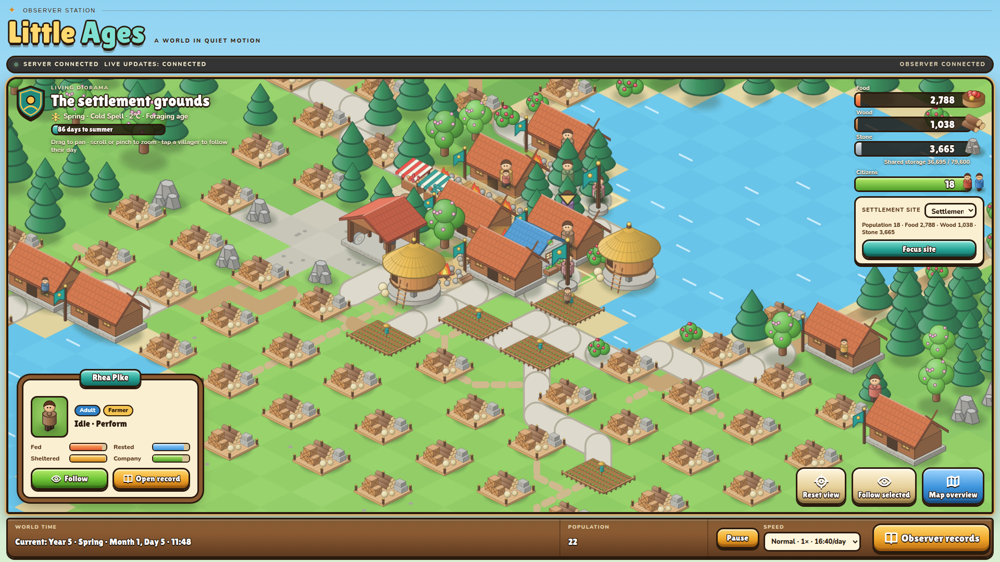
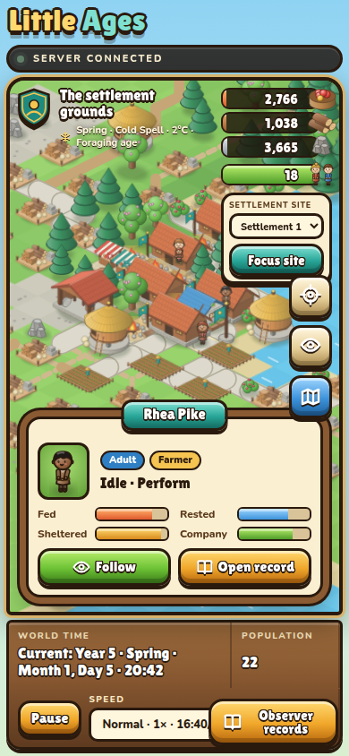
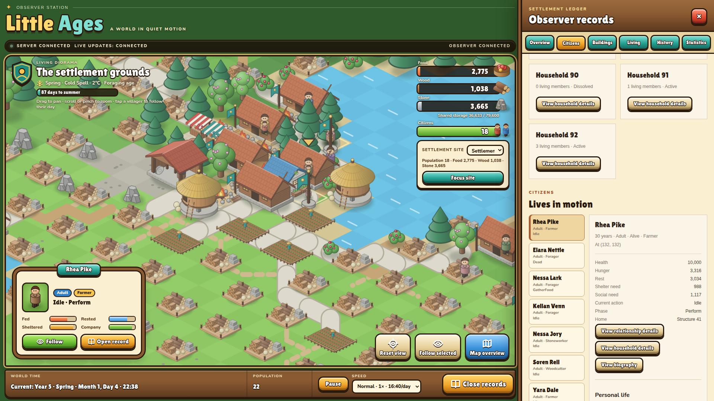
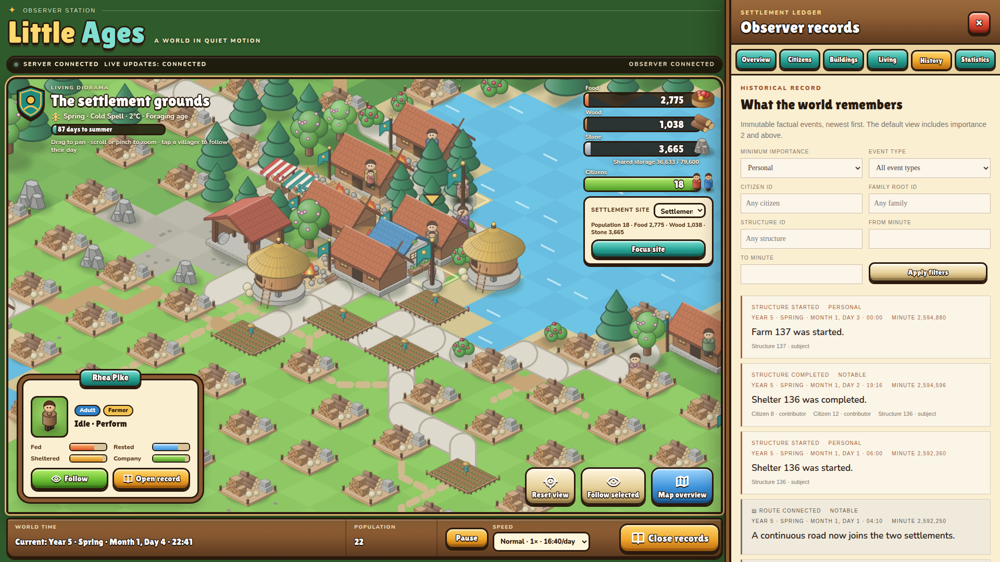
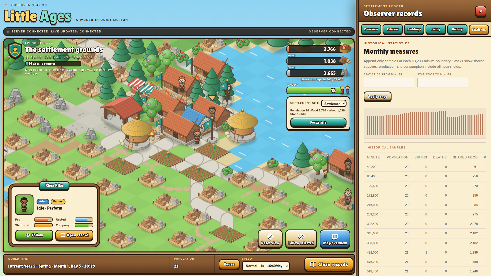

# Little Ages

[](https://github.com/joewolly/LittleAges/actions/workflows/ci.yml)
[](https://github.com/joewolly/LittleAges/releases)


**A persistent autonomous civilization simulation.** Start with a handful of
people, leave them alone, and come back later to discover what happened.

<p align="center">
  
</p>

## Overview

New worlds default to `m17-rng1-newcomers1`. It keeps every M15 system (worn
trails, paved roads, trade between two settlements) and the M16 settlement
planner: each village gets organic districts for homes, storage, crafts, and
farmland, storage grows through large storehouses in one yard instead of
stockpiles scattered across the map, and households share surplus wood and stone
instead of hoarding it. On top of that it adds annual harvest gatherings,
optional feasts, timed family visits, personal memories, and temporary festival
decorations. `m16-rng1-planned1` remains available explicitly. On server restart,
M14 and newer saves automatically receive the current features while preserving
their civilization. See [automatic world upgrades](docs/world-rules-upgrades.md) and the
[M16 festivals contract](docs/m16-festivals.md), the
[M16 layout contract](docs/m16-planned-layout.md), the
[M15 rules contract](docs/m15-roads-trade.md), and the
[M14 rules contract](docs/m14-migration.md).

The default [M17 visitors and newcomers](docs/m17-newcomers.md) ruleset,
`m17-rng1-newcomers1`, adds rare adult outsiders who walk in from the map edge,
visit an inhabited settlement and autonomously join or leave. Guests use their
own provisions and a spare shelter; their counts and histories stay separate
from residents. It also corrects fragmented household housing demand for M17.
Fresh worlds select it automatically. Explicit older rules, including M16
festivals, remain available. Set `AutoUpgradeWorldRules` to `false` to keep an
existing world's saved rules. Ordinary database loading and headless runs keep
their existing compatibility behavior.

The opt-in [v0.2 Living Settlement expansion](docs/living-settlement-v0.2.md)
adds coordinated work, farming and production, personal lives, weather and
wildlife, and knowledge passed between generations. Its opt-in
`v02-rng1-living2` variant raises Cut fuel output from 10 to 30 fuel per 10
wood. See the [living2 local acceptance report](docs/living-settlement-living2-acceptance.md)
and the preserved [living1 acceptance report](docs/living-settlement-acceptance.md).

Little Ages creates a deterministic world and lets its citizens live inside it.
They gather resources, survive changing pressures, form relationships, build a
settlement, create families, age, die, and leave behind factual history that
can be inspected long after the moment that created it.

The project is designed around a simple boundary: the simulation owns reality.
The server owns canonical state and persistence; the browser is an optional
observer and operational control surface. There is no LLM in the canonical
loop, and the UI cannot invent events or mutate gameplay state.

## See the application

These images are captures of the real observer UI running against disposable,
deterministic worlds (seed 42, year 5). The scene is the application: a painted
isometric village with route-smoothed citizens, a game-style HUD of storage
meters and villager cards, and a responsive, tabbed record ledger.

<p align="center">
  
</p>
<p align="center"><sub>The same authoritative world at a 390 × 844 mobile viewport</sub></p>

<p align="center">
  
  
</p>
<p align="center"><sub>Citizen biography and memories</sub>&nbsp;&nbsp;&nbsp;&nbsp;&nbsp;&nbsp;&nbsp;&nbsp;<sub>Factual historical record</sub></p>

<p align="center">
  
</p>
<p align="center"><sub>Append-only monthly statistics from the observed world</sub></p>

## What Little Ages currently simulates

- deterministic worlds with SQLite checkpoints and save/reload validation;
- autonomous citizens with needs, movement, gathering, survival, and mortality;
- resources, structures, construction work, storage, shelter, and settlement growth;
- relationships, bereavement, independent households, continuing generations, aging, and death;
- seasonal grain farming, granaries, winter reserves, and visible crop labor;
- household property, persistent occupations, a 20% communal contribution, physical
  marketplace barter, public-work payments in goods, and inheritance;
- append-only factual history, biographies, structured memories, and monthly statistics;
- a [Family & lineage explorer](docs/family-lineage.md) with named relatives,
  bounded generation views, exact recorded descendant counts, and explicit map follow;
- annual harvest festivals, optional shared feasts, and family visits under M16 rules;
- a painted 2D isometric village with seasons, Shelters that change look as the
  settlement learns, canonical route interpolation, a top-down map overview, and
  responsive observer records;
- browser observation of the map, settlement, households, citizens, relationships, history, and controls;
- headless `run`, `benchmark`, and `acceptance` commands for 1-, 10-, 100-, and 500-year horizons.

The `m12-rng1-spaced1` rule leaves a walkable tile gap around new construction
when a suitable site is available. Existing saves keep their selected rules
and building locations; the automatic upgrade path starts at M14.
The three local v0.2 delivery stages and acceptance evidence are recorded in
[Growing Settlement](docs/growing-settlement.md).
Publication and installation are separate from this local implementation.

The detailed rules, IDs, ordering, fingerprints, migration semantics, and
compatibility boundaries are documented separately; this page is intentionally
not a substitute for the simulation contract.

## How it works

```text
SimulationEngine  →  SimulationHost + SQLite checkpoints  →  React/Vite observer
 canonical reality       server, health, REST, SignalR          map and inspectors
```

`SimulationHost` is the single hosted mutation path. Connected observers receive
compact immutable scene frames through SignalR, while REST bootstraps the page,
refreshes slower ledger details, and remains the recovery fallback. The server
can run without a browser, and operational pause/resume/speed commands do not
become simulation facts.

For the full ownership and persistence contracts, see
[`docs/architecture.md`](./docs/architecture.md) and
[`docs/simulation-model.md`](./docs/simulation-model.md).

## Quick start

Development uses .NET SDK `10.0.100` from [`global.json`](./global.json) and
Node.js 22 with npm. From the repository root:

```powershell
dotnet restore LittleAges.sln --locked-mode
dotnet build LittleAges.sln --configuration Release --no-restore
dotnet test LittleAges.sln --configuration Release --no-build --no-restore
```

In one terminal, start a disposable local world:

```powershell
dotnet run --project .\src\LittleAges.Server\LittleAges.Server.csproj -- `
  --DataRoot .\artifacts\dev-worlds `
  --ListenUrls http://127.0.0.1:5274 `
  --ActiveWorld dev-world `
  --WorldSeed 42
```

In a second terminal, start the observer:

```powershell
Set-Location .\src\LittleAges.Web
npm ci
npm run dev
```

Open the Vite URL shown in the terminal, normally
`http://localhost:5173`. The browser is optional: the server owns and advances
the world on its own.

Windows Service installation, LAN binding, publishing, firewall boundaries,
backup/recovery, and sleep/resume checks belong in the specialized
[`docs/windows-service.md`](./docs/windows-service.md),
[`docs/backup-and-recovery.md`](./docs/backup-and-recovery.md), and
[`docs/sleep-resume-checklist.md`](./docs/sleep-resume-checklist.md) runbooks.

## Headless simulation

Headless mode runs the normal deterministic engine without wall-clock pacing.
The acceptance command writes invariant JSON/Markdown, checkpoints to SQLite,
reopens the database, and compares the continued run with an uninterrupted
run:

```powershell
dotnet run --project .\src\LittleAges.Headless\LittleAges.Headless.csproj `
  --configuration Release --no-build -- acceptance `
  --seed 42 --years 100 --rules m17-rng1-newcomers1 `
  --checkpoint-year 80 --database .\artifacts\acceptance.db `
  --output .\artifacts
```

See the [`v0.1 acceptance report`](./docs/v0.1-acceptance-report.md) for the
exact measured results, fingerprints, invariants, and remaining manual notes.
The [M16 contract](./docs/m16-festivals.md) records festival validation and
save/reload evidence.

## Documentation

[`docs/README.md`](./docs/README.md) is the documentation map. The short
version is:

| Area | Reference |
| --- | --- |
| Current runtime | [`architecture.md`](./docs/architecture.md) · [`simulation-model.md`](./docs/simulation-model.md) |
| Product and design baseline | [`design-v0.1.md`](./docs/design-v0.1.md) · [`implementation-plan-v0.1.md`](./docs/implementation-plan-v0.1.md) |
| Acceptance and compatibility evidence | [`v0.1-acceptance-report.md`](./docs/v0.1-acceptance-report.md) · [`living-settlement-living2-acceptance.md`](./docs/living-settlement-living2-acceptance.md) · [`living-settlement-acceptance.md`](./docs/living-settlement-acceptance.md) |
| Windows operations | [`windows-service.md`](./docs/windows-service.md) · [`windows-service.example.json`](./docs/windows-service.example.json) |
| Feature upgrades | [`world-rules-upgrades.md`](./docs/world-rules-upgrades.md) · [unreleased notes](./docs/release-automatic-world-upgrades.md) |
| Recovery and hardware checks | [`backup-and-recovery.md`](./docs/backup-and-recovery.md) · [`sleep-resume-checklist.md`](./docs/sleep-resume-checklist.md) |
| Automation | [`ci.yml`](./.github/workflows/ci.yml) · [`long-tests.yml`](./.github/workflows/long-tests.yml) · [`v01-acceptance.yml`](./.github/workflows/v01-acceptance.yml) · [`windows-package.yml`](./.github/workflows/windows-package.yml) |

## Project status

`v0.7.0` adds the Family & lineage explorer and clearer citizen crowds;
see its [release notes](docs/release-v0.7.0.md) and the
[Windows downloads](https://github.com/joewolly/LittleAges/releases).
M17 visitors and newcomers remain the default for new worlds.
The upcoming [automatic world upgrade](docs/world-rules-upgrades.md) update adds
restart upgrades for M14 and newer civilizations, with verified backups and an
option to retain saved rules.

The next observer update adds people search, browser favorites, Back navigation,
full-screen phone records and clearer Locate/Follow actions. See the
[implementation and validation notes](docs/observer-quality-of-life.md).

## License

No license file is currently included in the repository.
