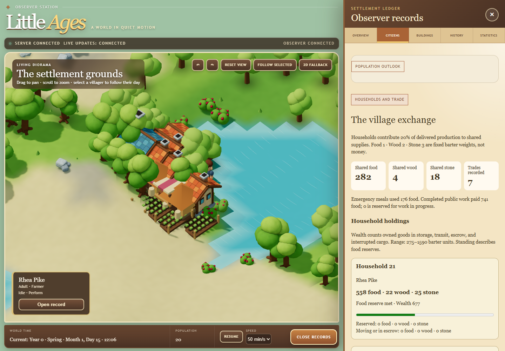
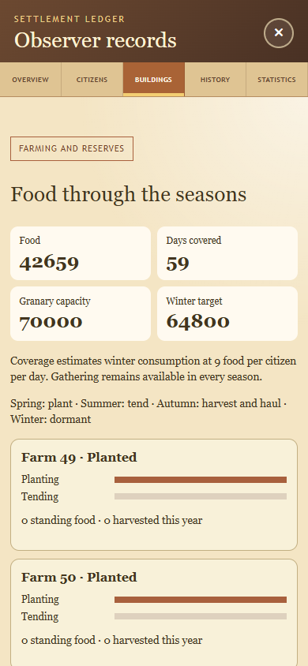
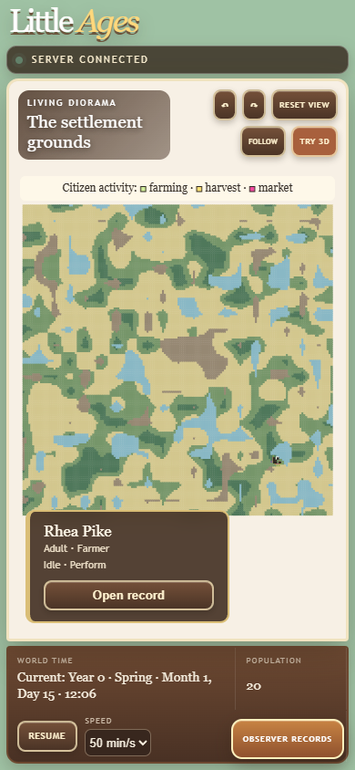

# Growing Settlement implementation evidence

This document records the three sequential local delivery gates. Publication,
installation, and modifications to the installed civilization are outside this work.

## Stage 1: sustainable generations

Stage rules: `m9-rng1-growth1`. The explicit compatibility rules are
`m8-rng1-balance1`; M8 remained the default until all three implementations were
complete. The final new-world default is M11; saved rules remain authoritative.
Fresh worlds can select growth with `--NewWorldRules m9-rng1-growth1`.
An existing database retains its own rules regardless of that option.

### Diagnosis and changes

The same generated maps, twenty founders, calendar, mortality, food consumption,
birth probability, health requirements, two-year birth spacing, and shelter sizes
are used in the baseline and growth comparisons. There is no immigration,
population floor, or resource injection. The `diagnose` headless command records
monthly age groups, mortality causes, partnership state, food, housing, and
overlapping reproduction blockers without changing simulation state.

M8's early losses come from exposure and deprivation. Fixed food targets do not
follow population; gathering into nearly full storage can leave workers waiting
to deposit instead of eating. Growth decision scoring prioritizes urgent meals,
rest, shelter construction, productive gathering, and social opportunities.
Prospective gathering accounts for workers already outbound and goods carried.
Citizens idle locally when needs and supplies are satisfied, avoiding needless
long trips. Food gathering targets 60 units per living citizen; ordinary wood and
stone reserves target 80 and 40, with construction deficits taking precedence.
Actual gathering still removes resources from finite regenerating nodes.

Every founder has a household. Unpartnered adults leave their parents' household;
new partnerships bring dependent children into a new household when the combined
size allows it. A surviving partner becomes eligible for a new relationship.
The deceased retains their partner-at-death reference, while immutable formation
and death records validate all transitions. Close kin means direct ancestry at
any depth or a shared ancestor within two generations of each person. First
cousins are excluded; second cousins can form partnerships. Legacy kinship and
partner-reference behavior remain unchanged.

The population outlook is available under Observer records → Citizens. It shows
births, deaths by cause, unpartnered adults, unhoused residents, food targets, and
the current blockers for active households. It is read-only and fetched only
while expanded. A ready household is eligible for the existing probabilistic
daily opportunity, not guaranteed a birth.

### Matched ten-year comparison

| Seed | M8 living | Growth living | M8 births | Growth births | M8 deprivation / exposure deaths | Growth deaths |
|---|---:|---:|---:|---:|---:|---:|
| 7 | 12 | 31 | 6 | 11 | 2 / 12 | 0 |
| 42 | 10 | 33 | 3 | 13 | 6 / 7 | 0 |
| 123 | 14 | 33 | 4 | 13 | 3 / 7 | 0 |
| 1001 | 11 | 29 | 1 | 9 | 7 / 3 | 0 |
| 20260918 | 9 | 36 | 2 | 16 | 10 / 3 | 0 |

All growth citizens are housed at year ten. Growth food holdings are respectively
1880, 2227, 2065, 1851, and 2168. Growth adult populations are twenty in each
world, with 20, 18, 18, 18, and 20 partnered adults. The remaining populations
are children. At that boundary, reproductive age and household/dwelling capacity
are the main blockers; no growth household is food-blocked. Eligibility varies
over time, and a zero ready count at this single boundary does not imply that
there were no opportunities during the preceding year. In M8, a partner reference
may point to a deceased person, so its raw partnered count is not a count of
currently viable pairs.

Raw monthly reports are under `artifacts/v02/baseline` and
`artifacts/v02/growth-trial4-ten`; the compact comparison is
`artifacts/v02/stage1-ten-year-comparison.json`. These are local ignored evidence.

### Validation status

Release build passes with zero warnings/errors. Backend non-long suite: 448
tests passed before the additional acceptance-validator regression; that new
regression also passes. Frontend lint, typecheck, 148 tests, and production build
pass. Existing Three deprecation and large-bundle notices remain.

The first seed-42 century comparison reached 40 living citizens, 54 births, 34
deaths, and ancestry depth 5. Uninterrupted and real SQLite reopen at year 37
were canonically identical. Its reporting gate exposed an old symmetric-partner
assumption for deceased citizens; the validator now distinguishes current living
partnerships from the historical partner-at-death reference. A focused regression
also proves that broken living partnerships are rejected. The corrected century
matrix passes every mandatory invariant:

| Seed | Living at 100 | Maximum ancestry depth |
|---|---:|---:|
| 7 | 27 | 5 |
| 42 | 40 | 5 |
| 123 | 70 | 5 |
| 1001 | 30 | 5 |
| 20260918 | 46 | 5 |

The seed-42 year-37 real SQLite reopen is exactly equivalent, with both canonical
snapshot fingerprints
`6555e10206f9d277872008280c09161e2ad7a3d7412d7fdba6c1142550f4c70b`.
Reports are in `artifacts/v02/growth-stage1-century/seed-<seed>`.
This completes Stage 1's survival/continuing-generations gate. The final v0.2
population target remains open: the current century median is 40, below 50–200.

A local self-contained Windows preview package was produced as
`artifacts/v02/stage1-package/LittleAges-v0.2.0-growth-preview-win-x64.zip`.
Its SHA-256 is
`f36eb48dad107bbe5e96b1005857d5983dc7edebd71d6d0dcc6173e2ca75f772`.
Packaged desktop (1440×1000) and mobile (390×844) checks pass for the population
panel, no horizontal overflow, pause/resume, supported speed changes, reduced
motion, 2D fallback, and recovery after a deliberately closed WebSocket and
offline interval. Screenshots were inspected. No application errors remained;
expected injected-offline errors and the pre-existing missing favicon are
recorded separately in `growth-packaged-qa.json` in the task visualization folder.
Browser plugin was unavailable; Playwright drove installed Chrome.

## Stage 2: farming and seasonal reserves

Implemented as `m10-rng1-agriculture1`; M9 remains frozen. One grain crop produces
Food. Suitable land is buildable, reachable, free of resource nodes, and has
fertility >= 3000 and water access >= 2000. Planting requires 1200 work and tending
2400, in shifts of 100. Autumn harvest shifts collect at most 40 Food and carry it
back to the communal depot. Winter closes the harvest; uncollected food is lost.
Potential yield is `3000 + (fertility + water) * 9000 / 20000`; actual yield scales
by planting completion and a tending multiplier from 25% to 100%, using integer
arithmetic. No weather, spontaneous food, or population additions are used.

A farm costs 60 Wood, 10 Stone, and 900 construction work. A granary costs 100 Wood,
60 Stone, and 1500 work and adds 10000 dedicated Food capacity. Storage is pooled
at the communal depot; granaries do not hold separate per-building inventories.
Non-food goods cannot occupy dedicated granary capacity. Construction targets
90 winter days at 9 Food per citizen per day and crop productive capacity of
1080 Food per citizen per year, leaving gathering useful throughout the year.
Food coverage is a projection, not a guarantee of adequate labor or harvests.

The ten-year seed-42 acceptance run has 32 living citizens, 12 births, and no
deaths. A real SQLite close/reopen at year 1 is canonically identical to the
uninterrupted result, including crops, work, harvest records, and pending hauling.
See `artifacts/v02/agriculture-acceptance/`. Focused reopen tests stop during actual
planting and harvest transport. A labor-loss fixture removes tending work before
autumn and demonstrates a smaller harvest followed by autonomous recovery the
next year; it adds no resources or citizens. Daily snapshot validation over a
year covers the full cycle. Harvest accounting requires yield = harvested + lost.

Release build passes with zero warnings. Backend checks pass: Domain 26,
Simulation 211, Persistence 148, Integration 58, Headless 12. The migration test's
expected schema list was updated and rechecked alongside both new reopen tests.
Frontend lint, typecheck, production build, and all 150 tests pass; one App test
timed out under concurrent backend load and its entire 23-test file passed on
recheck. A disposable copy of the M9 year-37 database opens under the M10 package
without changing any pre-existing table contents, adding agriculture state, or
violating foreign keys (`artifacts/v02/legacy-copy/result.json`). Its saved M9
rules remain authoritative even when the fresh-world option requests M10.

The local Windows package is
`artifacts/v02/stage2-package/LittleAges-v0.2.0-agriculture-preview-win-x64.zip`,
54116890 bytes, SHA-256
`c1d971add7dd8e5e51342634d231c8a208d416537f14f51605ee419f4700b5e7`.
Packaged desktop/mobile farming panels, production/consumption chart, harvest
records, controls, live updates, reconnect, reduced motion, and 2D fallback pass
with no horizontal overflow or application errors. Expected injected-offline
errors and the pre-existing favicon 404 are recorded separately. Screenshots and
browser results are in the task visualization directory under `agriculture-*`.

A new-rules-only fix releases citizens from WaitingForStorage after depositing
their last carried unit. The original behavior could strand an empty-handed
worker until death. M8 and M9 behavior remains unchanged.

## Stage 3: occupations, ownership, and physical barter

Implemented as `m11-rng1-barter1`. The canonical writer owns household stocks,
production cargo owners, occupations, offers, reservations, market escrow,
completed trades, public-work reservations, public supply transactions, and
inheritance. Version-1 economic facts are separate from unchanged historical
payloads and enum numbers. Agriculture and economy are focused partial modules.

### Economic rules and balancing record

Each living citizen belongs to one active household. Work specializations persist
and prefer existing assignments, then relevant skills, then citizen ID. Quotas
follow the workforce and available farms: builders/haulers/stoneworkers each
approximately one tenth, woodcutters one eighth, farmers up to one quarter and
two per field; remaining workers forage. Urgent hunger, rest, shelter, and food
shortages override occupational preferences. Children begin eligible work at 13;
adults always have a recorded occupation.

Production remains in the worker's original household ownership while carried,
even if the worker changes households. At delivery, 20% enters communal reserves;
per-household integer remainders preserve the exact cumulative share across small
loads. Private reserves target 120 Food per member for producers, 160 Wood, and
100 Stone. Market offers use lower reserve targets of 60 Food per member, 20 Wood,
and 10 Stone. The public gathering target is 12 Food per resident. Meals consume
unreserved household food first, then available communal emergency food.

A marketplace costs 80 Wood, 30 Stone, and 1000 work. Stable household/resource
ordering matches reciprocal requests using Food=1, Wood=2, Stone=3 accounting
weights, up to 20 integer multiples per trade. Goods are reserved before pickup.
Citizens travel to the depot, collect their own household's goods, and carry them
to the marketplace; both deliveries must reach escrow before ownership exchanges.
Storage capacity remains reserved during those trips. Trades expire after two
days. Cancellation or carrier death releases reservations, returns delivered
escrow, and retains interrupted physical cargo at its actual tile with an owner.
Ground cargo is conserved and observable; this version has no retrieval action.

Public construction uses communal materials. When private producers hold needed
surplus, a hauler may exchange available communal Food for those inputs at the
depot, then physically deliver materials to construction. Procurement preserves a
10-Food-per-resident communal floor for that purchase only; it does not create a
population or resource floor. Builders and haulers reserve up to 4 Food above that
meal reserve and receive it only for completed public work. Cancelled work returns
its reservation. No money, currency wages, debt, or variable prices are used.

Surviving households retain their property. An ending household transfers goods
to surviving former members' households, or to living descendants' households in
stable ID order, distributing integer remainders to the first recipients. Goods
with no claimant become communal. Stored and interrupted goods are covered.
Inheritance, household mergers, and the first trade are notable economic events;
routine deliveries do not flood the main historical feed.

Experimental trials are retained under `artifacts/v02/economy-trial*` and
`economy-century-trial6`. The original 800-unit founding depot caused private
stocks to obstruct essential building and early survival. M11 uses 4000 units of
initial storage capacity with the **same 400 Food and zero Wood/Stone**. Public
procurement resolves communal construction shortages while producers hold private
materials. An intermediate procurement retry loop was corrected by accounting for
an already-reserved work payment and delaying failed retries. The first century
trial had populations 46, 46, 56, 40, 49 (seed order 7, 42, 123, 1001, 20260918),
median 46. Four reports exposed a statistics validation mismatch: monthly Food
stocks must retain their historical communal meaning. That was corrected; actual
production and consumption include all owners. The revised candidate multiplies
only the existing eligible birth probability by 125%, retaining all health, food,
housing, relationship, reproductive-age, and two-year spacing requirements.
M8, M9, and M10 retain their accepted constants and behavior.

### Stage evidence

The first full barter suite passed 466 backend tests. Subsequent focused checks
pass contribution rounding, original cargo ownership after household changes,
unclaimed inheritance, cancellation/death, finite-support extinction, and a poor
harvest followed by autonomous recovery. Real SQLite close/reopen tests cover
planting and harvest transport under both M10 and M11, one-sided marketplace
escrow, completed trades, and descendant inheritance. The checkpoint failure test
proves transactional rollback; corrupt duplicate ownership is rejected on load.
Daily checkpoints validate exact global Food/Wood/Stone conservation and storage.

Frontend lint, typecheck, production build, and all 152 tests pass (the complete
suite was run with two workers to avoid a five-second App timeout under heavy
parallel simulation load). Bounded agriculture/economy REST reads use decimal
string IDs and never advance the simulation. Detailed inventory/trade arrays do
not enter compact live scene frames. Household detail includes inventory; citizen
observations expose specialization; wealth derives from owned stored, moving,
escrowed, and interrupted goods. Social standing only describes food reserves.

The packaged barter preview passed desktop/mobile layout, live updates,
pause/resume/speed, reconnect, reduced motion, and 2D fallback checks. An observed
market trip at minute 5619 has carrier 12 physically carrying 24 Food for a pending
exchange of 8 Stone; neither side was delivered yet. Its authoritative JSON and
inspected screenshot are `economy-market-cargo.*` in the visualization directory.
The preview ZIP SHA-256 is
`ea11b311c446a15430f3965dc8c49c0399dd72f328187a921eaee6f6123ba446`.
It predates the final cargo-owner and balancing changes; the final package and
acceptance results are recorded separately below.

## Final v0.2 acceptance

M11 balancing constants were frozen in commit `3e0360e` on 2026-09-20 before
final long-horizon acceptance. Later commits only refine the 2D observer legend
and the measurement script. No canonical domain, simulation, or persistence code
changed after the freeze. The candidate matrix completed with populations
52, 42, 68, 54, and 96, median 54, and maximum ancestry depths 6, 5, 5, 5, and 6.
Final acceptance reran all five seeds and compared seed 42 against a real SQLite
reopen at year 37. All gates pass; the complete results are below.

Release build passes with zero warnings. Backend checks pass: Domain 26,
Simulation 220, Persistence 154, Integration 61, and Headless 12 (**473 total**).
The complete Integration suite and all Headless tests were repeated after the
new default and observer changes. Frontend lint, typecheck, all 152 tests, and
production build pass. The stock meter includes private goods and escrow; new
structure counts include farms, granaries, and markets. The 2D fallback has
separate activity colors and a visible legend for farming, harvest hauling, and
market trips. The legend was moved clear of the selected-citizen card after
inspection at 390 x 844.

### Matched ten-year diagnosis

Both runs use the same fixed seeds, generated maps, twenty founders, ten-year
horizon, and monthly observation cadence. Different rules and their declared
versioned constants are the only gameplay differences. Full monthly records,
including age distributions and overlapping reproductive blockers, are retained
in `artifacts/v02/baseline/` and `artifacts/v02/final-diagnosis/`.

| Seed | M8 living | M11 living | M8 exposure / deprivation deaths | M11 deaths | M11 births | M11 partnered adults | M11 children / young children | M11 housed / capacity |
|---|---:|---:|---:|---:|---:|---:|---:|---:|
| 7 | 12 | 33 | 12 / 2 | 0 | 13 | 18 | 7 / 6 | 33 / 36 |
| 42 | 10 | 30 | 7 / 6 | 0 | 10 | 20 | 5 / 5 | 30 / 36 |
| 123 | 14 | 33 | 7 / 3 | 0 | 13 | 20 | 7 / 6 | 33 / 36 |
| 1001 | 11 | 32 | 3 / 7 | 0 | 12 | 20 | 5 / 7 | 32 / 36 |
| 20260918 | 9 | 35 | 3 / 10 | 0 | 15 | 18 | 10 / 5 | 35 / 40 |

All twenty M11 founders survive through year 10. At the final monthly sample,
no M11 household is blocked by food or poor health/hunger; age, household size,
actual home capacity, and birth spacing still restrict opportunities. One seed-42
household is currently ready. The other seeds have zero ready households at that
particular sample, demonstrating that growth is not continuously forced. Housing
blocker counts can overlap household-size and age blockers; unused settlement
capacity does not imply room in a particular household's dwelling. The optional
M8 century extension was stopped in favor of these completed matched comparisons;
its partial logs are retained and are not acceptance evidence.

### Local package and compatibility

The final self-contained ZIP is
`artifacts/v02/final-package-verified/LittleAges-v0.2.0-win-x64.zip`.
Size: 54,166,183 bytes. SHA-256:
`4364d4cff31e8db1be409bb699395fd26704f069ba53314d3bfbecf6060dc23a`.
It includes all seven existing diorama GLBs (1,105,956 bytes total); farms,
granaries, and markets are procedural scene geometry. Packaging used the existing
disposable win-x64 lock-graph recovery and revalidated those graphs in locked mode.
The checked-in dependency locks were preserved; npm reported zero vulnerabilities.
Vite's existing large 3D chunk warning remains.

Disposable M9 and M10 databases open under the final backend with Healthy
persistence. Hashes of every pre-existing table remain unchanged, foreign-key
checks are empty, and neither copy gains an economy row. M9 has no agriculture
row; M10 keeps its one existing agriculture row. See
`artifacts/v02/final-legacy-m9/result.json` and `final-legacy-m10/result.json`.
M8 compatibility is also exercised by the pinned historical suites. Experimental
M11 preview databases from before the canonical cargo-owner field are development
artifacts, not released save formats. No installed world was opened or modified.

Final packaged desktop/mobile checks cover live updates, reconnect after an
injected WebSocket close and offline interval, pause/resume/speed, reduced motion,
2D fallback, and no horizontal overflow. Application errors are empty; the
pre-existing favicon 404 and deliberately injected offline errors are recorded
separately. Screenshots and QA JSON are in the task visualization directory under
`v02-final-*`. A larger naturally grown settlement is checked separately.

### Measurement method

`scripts/Measure-GrowingSettlement.ps1` creates an isolated probe and database
copies. It warms up one simulated day, measures ten days, captures an exact
checkpoint, performs a real reopen, and compares social, history, agriculture,
and economy fingerprints. SQLite's backup API copies sources without editing
them. Output directories must be new. The preparation run grows a seed-20260918
world naturally to year 80; measured ordinary and larger runs then use separate
processes. No synthetic citizens or resources are added.

The local host is Windows 11 build 26200, .NET 10.0.0 runtime / SDK 10.0.100,
AMD Ryzen 5 5600X (6 cores / 12 logical processors), approximately 31.9 GiB RAM,
and an RTX 3060 Ti. Browser measurements use installed headless Chrome at
1440 x 1000, normal motion, operational speed 10, and the actual packaged app.
Measured renderer information, adaptive detail tier, frame intervals, long tasks,
and JavaScript heap are recorded with the results. They are local observations,
not claims about other hardware or unmeasured mobile frame-rate targets.

### Final century results

Every seed is reported, including the smaller seed-42 settlement. All mandatory
invariants pass; all final agriculture/economy state and social/history fingerprints
also match the corresponding frozen-candidate replay. Founders are ancestry depth
zero, so depths 5 and 6 represent six and seven generations including founders.

| Seed | Living at 100 | Births | Deaths | Ancestry depth | Completed trades | Inheritances | Invariants |
|---|---:|---:|---:|---:|---:|---:|---|
| 7 | 52 | 75 | 43 | 6 | 256 | 3 | Pass |
| 42 | 42 | 61 | 39 | 5 | 191 | 7 | Pass |
| 123 | 68 | 87 | 39 | 5 | 243 | 4 | Pass |
| 1001 | 54 | 74 | 40 | 5 | 209 | 6 | Pass |
| 20260918 | 96 | 123 | 47 | 6 | 282 | 6 | Pass |

**5/5 survive; median population 54; all demonstrate at least four generations.**
Seed 1001 records one cancelled trade, in addition to the 209 completed trades.
The targeted scarcity fixture still exhausts finite supplies and becomes extinct;
these favorable standard-seed outcomes do not create a survival guarantee.

Seed 42 reaches minute 51,840,000 after 100 years. Run A is uninterrupted. Run B
writes SQLite at year 37 (minute 19,180,800), closes the connection, opens the real
database, restores the engine, and continues. Their complete canonical snapshot
fingerprints are identical, with zero mismatched components:

`2077c414ddb7d41cefc621e24031049acb153c4b6f40bb01d46123e8566e6d87`

This covers canonical metadata, counters, pending events, people, resources,
structures, relationships, households, history, statistics, memories, crops,
work, ownership, offers, reservations, cargo, escrow, and economic events. The
focused planting, harvest hauling, escrow, settlement, inheritance, corruption,
and atomic rollback tests provide additional seam coverage.

### Measured performance

The two ten-day probe measurements were separate processes; background desktop
activity and the last acceptance worker were not isolated. The browser profile
and some measurement work overlapped. These are reproducible local measurements,
not a controlled cross-hardware benchmark. The early-village workload contains
more construction and discovery, so events/second is not a pure population
scaling ratio. Initial checkpoint timings include database/provider startup.

| Measurement | Ordinary, 20 residents | Larger, 80 residents |
|---|---:|---:|
| Ten-day events | 9,489 | 48,537 |
| Advance elapsed | 2.803 s | 0.869 s |
| Events/second | 3,385 | 55,858 |
| Snapshot creation | 192.9 ms | 434.6 ms |
| Final checkpoint | 1836.0 ms | 3645.0 ms |
| Peak working set | 298.2 MiB | 302.4 MiB |
| Database after / ten-day growth | 1,359,872 / +20,480 bytes | 2,990,080 / +4,096 bytes |
| Browser mean frame interval | 31.25 ms | 38.76 ms |
| Browser mean cadence | 32.0 FPS | 25.8 FPS |
| Browser p95 frame interval | 31.6 ms | 62.7 ms |
| Browser JS heap | 81.4 MiB | 96.9 MiB |

Chrome 153.0.8010.48 used ANGLE / RTX 3060 Ti / Direct3D11. Both scenes selected
the renderer's reduced detail tier. Each frame profile contains 599 samples after
120 warmup frames. The ordinary profile recorded one long task totaling 330 ms;
the larger profile recorded two totaling 134 ms. The diagnostic renderer snapshots
show 234 versus 887 draw calls and approximately 316,000 versus 3.78 million
triangles. Dense storage buildings can obscure citizens in the default larger-
village camera view; camera controls, citizen records, and 2D fallback remain
available. These results do **not** establish a 60 FPS target or a mobile FPS claim.

The naturally grown preparation database increased from 1,323,008 bytes at
founding to 2,879,488 at year 80. The ten-day table preserves the source database's
SQLite allocation history on both sides. Earlier exploratory measurements compared
against fresh compact files and could show apparent shrinkage; those are retained
but are not used for the final growth figures. Both final probes reopen exactly.

[Machine-readable acceptance and measurements](acceptance/v0.2-growing-settlement.json)
retain all seed results, fingerprints, package provenance, and measured values.
Full reports remain under `artifacts/v02/final-acceptance/`; final probe output is
under `artifacts/v02/performance-ordinary/` and `performance-larger/`.

### Reproduce locally

```powershell
dotnet run --project src/LittleAges.Headless -c Release -- acceptance --rules m11-rng1-barter1 --seed 42 --years 100 --checkpoint-year 37 --database artifacts/recheck/world.db --output artifacts/recheck/report.json
./scripts/Measure-GrowingSettlement.ps1 -OutputDirectory artifacts/measure-ordinary
./scripts/Measure-GrowingSettlement.ps1 -OutputDirectory artifacts/prepare-larger -Seed 20260918 -PrepareYears 80
./scripts/Measure-GrowingSettlement.ps1 -OutputDirectory artifacts/measure-larger -SourceDatabase artifacts/prepare-larger/world.db
```

Use the pinned SDK 10.0.100; pass `-Dotnet` to the measurement script if it is not
on PATH. Acceptance database paths and measurement output directories must be new.
No publication, installation, or reset of the running civilization was performed.

### Packaged observer captures






