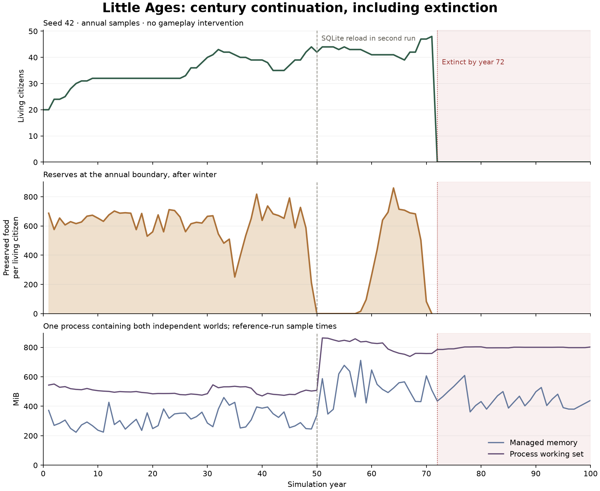
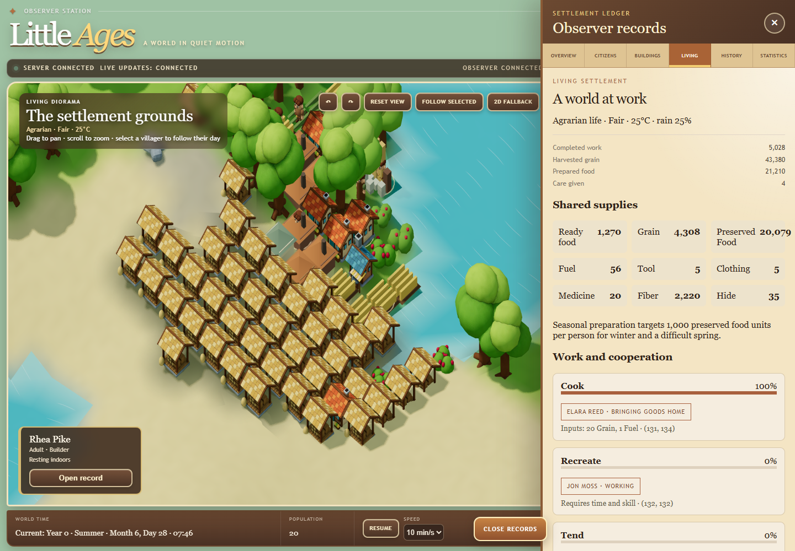
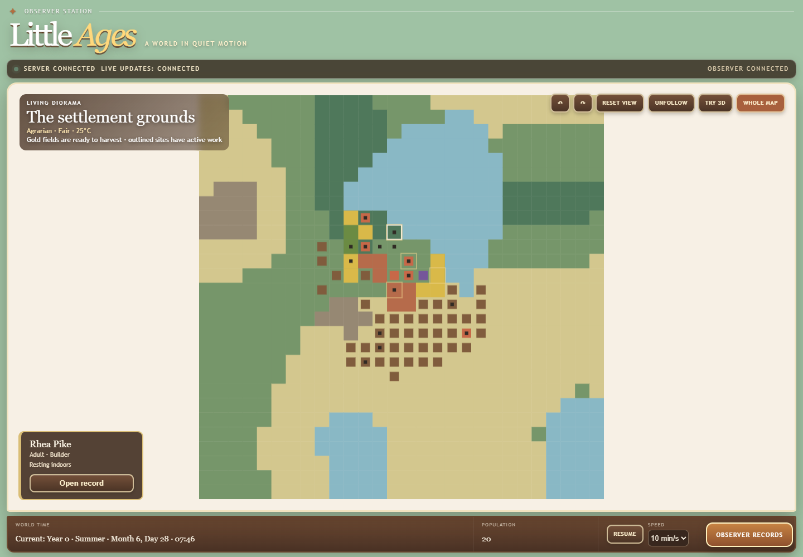

# Living Settlement acceptance

Local validation of `v02-rng1-living1` on `codex/living-settlement`, developed
from `a7a83b59f66b6a6d7b5d4188becda6f98e55a046`. These are working-tree results,
not hosted CI or deployment results. Existing installations and saved worlds
were not changed. See the [successor design](living-settlement-v0.2.md).

**Correctness, reload determinism, and observer checks passed. Seed 42 raised
four descendant generations, then became extinct between the year-71 and
year-72 samples. This run does not demonstrate a surviving century settlement.**

## Build and regression checks

Locked restore and Release compilation passed with .NET SDK **10.0.100** on
Windows, with zero build warnings or errors. The normal `Category!=Long`
backend suite passed, followed by six additional focused acceptance cases:

| Project | Passed |
| --- | ---: |
| Domain | 26 |
| Simulation | 232 |
| Persistence | 151 |
| Integration | 58 |
| Headless | 11 |
| **Backend total** | **478** |
| Frontend | **150** |

Frontend ESLint, TypeScript checking, and the Vite production build passed.
Vite retains the existing large-3D-bundle advisory. Legacy golden vectors and
fixtures were not changed; the existing fast compatibility checks passed.
The older `Category=Long` legacy acceptance suites were not rerun; the new
living-rules century run is separate evidence.

## Controlled and persistence evidence

- Fresh worlds discover techniques, establish fields and facilities, harvest,
  prepare food, teach, and produce essential goods without commands.
- Goals, experiences, relationships, and urgent needs affect work selection.
  Hungry citizens can perform the steps needed to make food when no meal is
  available; available food and urgent rest retain precedence.
- A seeded cold spell, compared with identical warm starting conditions,
  damages crops, consumes fuel, increases illness, and raises fuel-work priority.
  The weather fact and crop condition are visible in the immutable observation.
- Injured citizens receive care. Teaching creates another holder of expertise;
  removing the original holder leaves the learned technique usable.
- Interrupted and deceased workers release claims while retaining progress
  and owned materials. A replacement must reach the actual supplies or cargo
  before transporting them. Full-storage conversion, finite work admission,
  malformed recipes, duplicate claims, and capacity violations are covered.
- A controlled fed wildlife population moves locally, reproduces with stable
  identities, and removes starving animals.
- Real SQLite files were closed and reopened at minutes 4,777, 42,000, and
  160,000, including failed-checkpoint rollback. Additional runs locate active
  **sowing, preservation, care, and teaching**, checkpoint during work, reopen,
  and compare seven further days with 97-minute versus uninterrupted advances.
  Canonical living state and complete history fingerprints match. Persisted
  historical prefixes cannot be rewritten or removed.

## Fixed multi-seed suite

All worlds begin with 20 founders. No citizen commands or resource injections
are used. Seeds are fixed at **42, 7, and 12345**; unsuccessful development
runs were not substituted with easier seeds.

| Seed | Years | Final population | Births | Deaths | Extinct | Shortage episodes | Canonical invariants |
| --- | ---: | ---: | ---: | ---: | --- | ---: | --- |
| 42 | 100 | 0 | 52 | 72 | Yes, by year 72 | 5 | Pass |
| 7 | 10 | 32 | 13 | 1 exposure | No | 0 | Pass |
| 12345 | 10 | 29 | 9 | 0 | No | 0 | Pass |

Seed 7 finishes with 16 fields, ten production facilities, 21,896 preserved
food, spare tools and garments, and treatment supplies. Seed 12345 finishes
with 15 fields, ten facilities, and 18,927 preserved food. All five techniques
have 23 and 25 living holders respectively. Successful care totals are 16,528
and 13,890. These totals include recurring childcare.

The two ten-year worlds lose their initial local wildlife populations. This
closed local model has no immigration or automatic animal replacement.
Movement, feeding, reproduction, hunting, and avoidance are implemented;
the fixed suite does not demonstrate a persistent wildlife population.

## Determinism and long-term behavior

Seed 42 runs two independent worlds through 100 years. The reference uses
annual advances. The second uses different chunk sizes, writes a real SQLite
checkpoint at year 50, closes it, reloads, and continues. Final comparison
includes canonical state, counters, scheduled events, geography, citizens,
relationships, work, goods, conditions, knowledge, and history.

The year-50 database contains 42 living people and 29 living holders of each
technique. Four original discoverers have died; their cultivation, toolmaking,
textiles, and preservation knowledge remains available. Its 215 teaching facts
provide direct evidence of transmission beyond the discoverers.

Both worlds reach minute **51,840,000** with **zero canonical mismatches**.
The complete snapshot fingerprint is identical:

```text
e1baf0a6ed1b259966622a763b29064ef194d8e5dc256a82d0d085bdfca9be08
```

Their history fingerprint is also identical:

```text
3d47a1d4cc2dfc1fb4198095ca7b3c45061af029b781f4ded24d2ceec4754e8b
```

The operational processed-event counter resets on reload. Consequently, the
two report fingerprints and reported event counts differ; these are separate
from the equivalent canonical snapshots and their compatibility fingerprints.

| Year | 0 | 10 | 20 | 30 | 40 | 50 | 60 | 70 | 71 | 72–100 |
| --- | ---: | ---: | ---: | ---: | ---: | ---: | ---: | ---: | ---: | ---: |
| Population | 20 | 32 | 32 | 40 | 39 | 42 | 41 | 47 | 48 | 0 |

There are 22 natural deaths, two exposure deaths, and 48 starvation deaths.
The peak population is 48, and maximum ancestry depth is four. The settlement
establishes 24 fields and 14 facilities, completes 1,069,175 orders, harvests
7,272,627 grain, prepares 3,611,640 meals, and performs 58,750 care actions.
Meal preparation excludes separately preserved food; care includes childcare.

The records show recovery as well as failure. Preserved reserves fall to zero
at year 50, then recover to 35,257 units for 41 people at year 64. Later, the
population rises from 42 at year 68 to 48 at year 71. Annual harvests and care
continue, but reserves fall from 28,681 to zero. All remaining citizens starve
before the year-72 sample. Five shortage episodes are recorded; four end with
living citizens, while the last closes because the population becomes zero.
That final closure is **not a recovery**.

Annual evidence establishes a sustained food deficit and continuing work
before extinction. It does not isolate every contributing decision, weather
event, and demographic effect. Long-term food balance under growth remains a
limitation, and no claim of century-long viability is made. The final work
board has no claims, reservations, in-transit cargo, or partial work stranded
by the deceased. Its remaining jobs lack ingredients or living expertise.



Annual snapshots validate ownership and capacity and record work completion
and the oldest pending order. In the ten-year runs the maximum sampled waiting
age is 54 days (seed 7) and 47 days (seed 12345). Seed 7's remaining older orders
are unclaimed cooking jobs waiting for winter grain while preserved food is
available. Work continues each year; a seasonal prerequisite wait is distinct
from a stranded claim or stalled production cycle.

Seed 42's maximum sampled waiting age while occupied is 266 days. Its work
completion counter still increases by 20,155 and 20,370 orders during years
70 and 71. After extinction, unclaimed pending work remains visible; its age
reaches 10,604 days at year 100. This is an abandoned settlement, not evidence
of a living worker retaining an impossible claim. Annual sampling and focused
regressions do not prove the absence of every possible transient stall.

## Measured performance and retained state

These concurrent local runs are measurements, not performance guarantees.
Canonical living-state size includes retained factual history and deceased
citizens; it is expected to grow. Behavioral experiences remain capped at 24
per person. Derived travel caches are bounded and rebuilt after reload.

| Seed | Runtime | Events/second | Annual managed-memory samples | Annual working-set samples | Living JSON, year 1 → final |
| --- | ---: | ---: | ---: | ---: | ---: |
| 42, reference | 2,545.81 s | 25,573 | 221–711 MiB | 470–868 MiB | 50,878 → 1,558,382 bytes |
| 7 | 416.14 s | 14,062 | 119–344 MiB | 304–410 MiB | 47,011 → 147,822 bytes |
| 12345 | 556.66 s | 13,829 | 127–238 MiB | 299–391 MiB | 60,118 → 148,633 bytes |

The century reference processes 65,104,882 events. The reloaded run takes
2,559.23 seconds. Century memory ranges cover both independently advancing
worlds in one process, including SQLite reload allocations. They are sampled
values, not allocation limits or isolated per-world measurements. Living JSON
is measured per world and reaches 1,434,032 bytes at year 71. Retained weather
facts continue growing after extinction. The empty-world tail makes aggregate
century throughput unsuitable as a sustained populated-world benchmark.

## Actual observer validation

The built application was exercised against a disposable seed-42 server at
1440 × 1000 and 390 × 844. Verified: Living records, personal inspection,
citizen following, pause/resume, speed changes, 3D rendering, and 2D settlement
and whole-world views. No page errors or horizontal mobile overflow occurred.
Paused living JSON remained byte-identical after inspection and rendering.

A real network interruption put SignalR into reconnecting state. The world
advanced while the browser was offline. Reconnection triggered new REST reads,
and the returned living state exactly matched the authoritative server state.

One 20-citizen Chrome sample measured 55 FPS, 18.6 ms p95 frame time, and 0.88 s
scene readiness. This was an automated local browser sample, not a broad device
benchmark. New-world buildings and citizens fit the occupied tile scale; legacy
world presentation keeps its existing scale.

The screenshot shows 20,079 preserved food for 20 citizens before the first
winter, exceeding the seasonal preparation target without intervention.





## Reproduction and artifacts

Run the fixed suite from the repository root:

```powershell
.\scripts\test-living-acceptance.ps1 `
  -DotNetPath 'dotnet' `
  -OutputDirectory './artifacts/living-settlement/new-acceptance'
```

Use a fresh output directory and .NET SDK 10.0.100. Pass the absolute runtime
path with `-DotNetPath` if it is not on `PATH`. The script builds an isolated runtime and writes
per-seed reports, annual JSON lines, process IDs, a real century database, and
a final summary. Current local evidence is under:

- `artifacts/living-settlement/final-validation`: final fixed-suite reports,
  progress, runtime hashes, canonical source-file hashes, checkpoint inspection,
  and century analysis. The original source manifest describes the acceptance
  build; `final-source-hashes.json` records the final working tree. The only
  subsequent headless-source edit improves the invalid-rules error message.
- `artifacts/living-settlement/final-tests`: TRX files and frontend JSON results.
- `artifacts/living-settlement/browser-*.json`: actual application checks.

These generated artifacts are ignored by Git. Earlier diagnostic runs exposed
undersized seasonal reserves, excessive meal portions, limited cooking
throughput, and urgent-work starvation. Their failures led to concrete fixes;
they are not presented as accepted results. The final suite uses the corrected,
explicit living rules without changing any legacy golden or balancing rule.
