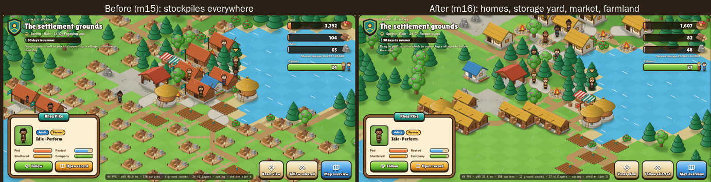

# M16 - Planned settlement layout

**Status:** implemented; `m16-rng1-planned1` is the new-world default.

## Intent

Up to M15, every new building took the nearest free tile to the settlement
site, whatever it was. Villages grew as rings in the order things happened to be
needed, so homes, stockpiles, farms and hearths ended up interleaved. Storage
made it worse: a new stockpile was ordered every time storage passed 80% full,
and each one landed wherever the edge of the ring was at the time. On seed 42,
a 22-person village had 57 stockpiles spread over 23 tiles after five years.

M16 puts a settlement planner behind those decisions:

- each settlement gets an organic plan with **districts**: a core plaza,
  a storage yard, homes, a craft quarter, and farmland;
- every new building goes to the next free plot in its own district;
- storage grows through large **storehouses** packed into one yard, with a quick
  stockpile to supplement when the village is small or storage is nearly full;
- households keep only the wood and stone they can use and **share the
  surplus**, so villages stop gathering, and storing, materials nobody needs.

## Compatibility and scope

`m16-rng1-planned1` includes every M15 system: `MigrationSystemsEnabled`,
`UnifiedSimulationRulesEnabled` and `RoadSystemsEnabled` return true for it. A
new `PlannedLayoutEnabled` returns true only for M16.

Existing saves keep their recorded rules, and M15 and earlier worlds stay on
them. Their placement code paths, fingerprints and acceptance evidence are
unchanged. Moving an existing world to M16 is out of scope.

The database gains one migration, `20260930000000_M16Storehouses`, which
rebuilds the `structures` table so its type constraint admits storehouses. Every
row and index is preserved. Older worlds can never hold a storehouse:
loading one under earlier rules is rejected.

## The plan

A plan is derived only from immutable geography and the settlement's fixed site,
so it is never checkpointed. The same world and site always rebuild the same
plan (`SettlementPlan.Create`).

1. **Survey.** Buildable tiles within 10 tiles of the site that the site can
   reach are grouped into eight compass sectors. Each sector is scored by
   farmable yield (`AgricultureRules.PotentialYield` of suitable tiles) and by
   wood and stone resource nodes.
2. **Orientation.** Farmland faces the most fertile sector. The storage yard
   sits one sector to the side of the fields, on the side with more wood and
   stone, so haulers from both have short trips. The craft quarter takes the
   opposite flank, and homes spread out behind the core, away from the fields.
3. **Anchors.** Each district gets an anchor a fixed distance out along its
   bearing (storage 3, crafts 4, homes 4, farmland 6), snapped to the nearest
   reachable, buildable tile outside the plaza.
4. **Claims.** Every tile within two tiles of the site is core plaza. Every
   other reachable tile is claimed by the district with the lowest weighted
   terrain travel cost from its anchor (weights: homes 85, storage 100,
   farmland 110, crafts 125; lower claims more). Travel costs ignore roads, so
   the plan never shifts as roads form.

Districts follow the terrain: they bend around water and forest instead of
forming fixed rectangles.

## Placement

| Building | District | Spacing |
| --- | --- | --- |
| Shelter | Homes | one-tile gap |
| Stockpile, Storehouse, Granary | Storage | packs edge to edge with other storage |
| Workshop, Loom, Care house | Crafts | one-tile gap |
| Marketplace | Core | one-tile gap |
| First hearth | Core | one-tile gap |
| Later hearths | Homes (they cook for the homes around them) | one-tile gap |
| Farm | Farmland (richer ground preferred) | one-tile gap |
| Living field | Farmland | packs edge to edge with other fields |

The site itself always keeps a one-tile clearing. Candidates are the same tiles
the M15 pickers allowed. `SettlementPlanner.Choose` ranks them by terrain travel
cost from the district anchor, then distance to the site, then Y and X, and
tries them in widening passes:

1. inside the district, with spacing, off worn trails and roads;
2. in any district except the plaza, with spacing, off worn paths;
3. in any district except the plaza, with spacing;
4. anywhere with spacing;
5. anywhere.

A crowded site therefore still grows. Leaving trails and roads (grade `Trail`
or better) open keeps the village's streets clear.

## Storehouses

| | Stockpile | Storehouse |
| --- | --- | --- |
| Storage added | 800 | 2,400 |
| Wood / stone / work | 60 / 30 / 900 | 120 / 60 / 1,800 |

A storehouse holds three stockpiles' worth for the materials of two. When a
planned settlement's storage passes 80% full, a new village (fewer than 8 residents
and fewer than 2 stockpiles) builds a quick stockpile. An established village
builds a storehouse, except that when storage is at least 95% full it may add a
quick stockpile for relief, up to 4 stockpiles in total. A small daughter hamlet
therefore starts with a couple of stockpiles and then grows through storehouses
like the main village, and a store that is always full cannot fill up with
stockpiles again. All general-storage capacity sums go through
`CitizenSimulationRules.GeneralStorageOf`.

## Household surplus

Under M15, 80% of everything a citizen gathers goes into the household's
private stock, and 20% into the commons. Construction, fuel and facility work
draw only from the commons. Private wood and stone leave only through barter, a
sale to a short-handed construction project, or a household moving. So the
commons stayed nearly empty, which kept the common reason to gather wood and
stone switched on (a score of 9,500 while a project is short, 2,500 while the
pile is under 80 wood or 40 stone). Citizens gathered without end, and 80% of
every load piled up privately. On seed 42 at year 3, private wood and stone were
about three quarters of everything in storage. Because the 80% storage trigger
counts private goods, villages kept building storage to hold the hoard.

M16 breaks the loop when production is deposited. A household keeps up to
**320 wood** and **200 stone** (twice the 160 and 100 it gathers for on its own
account). Anything above that from its own production joins the commons. The
commons then fill, the common reason to gather goes quiet, and gathering
resumes only when a project or the pile needs it. Barter and relocation can
still move goods into a household, so its holdings can sit somewhat above the
limit. The limit applies only to new production.

Food is not capped. In the calibration runs, capping food at 240 per household
member moved the surplus into the commons, where nothing consumed it: commons
food reached 70,000 to 97,000 units by year 10, and storage grew instead of
shrinking.

One side effect: injuries happen while gathering wood or stone, or building.
With less needless gathering, fewer villagers get hurt, so the Care technique,
which needs someone injured or ill, and its care house can arrive later or not
at all within ten years.

## Observation

- The server reports storehouses as `Storehouse` structures with a
  `storageBonus` of 2,400. Settlement summaries add `completedStorehouses`,
  which is omitted when zero, so older worlds' payloads are unchanged.
- The painted village draws storehouses as a timber barn on a stone footing,
  in all four seasons. Run `python scripts/build-sprite-assets.py` to rebuild
  the sprite kit.
- `SimulationEngine.CaptureLayouts()` reports each settlement's buildings,
  what fills its storage, and three tidiness measures:
  - **storage spread**: the largest distance between two storage buildings;
  - **storage nearest neighbour**: the mean distance from each storage
    building to its closest storage neighbour;
  - **mixed neighbours**: the percentage of buildings whose closest neighbour
    serves a different part of village life.

  Headless reports for M16 worlds include these as `layouts`. The field is
  absent for earlier rules, so their report fingerprints do not change.

## Evidence

### Planner and storehouses

Same seed, same horizon, M15 versus M16 before the household surplus rule,
measured at each settlement:

Storage spread is the largest distance, in tiles, between two storage buildings.
Mixed neighbours is the percentage of buildings whose closest neighbour serves a
different part of village life.

| Seed, horizon, settlement | Rules | Storage buildings | Storage spread | Mixed neighbours |
| --- | --- | --- | ---: | ---: |
| 42, year 3, main village | M15 | 57 stockpiles | 23 | 18% |
| | M16 | 12 storehouses | 8 | 7% |
| 7, year 10, main village | M15 | 145 stockpiles | 43 | 11% |
| | M16 | 37 storehouses, 4 stockpiles | 16 | 8% |
| 7, year 10, daughter hamlet | M15 | 46 stockpiles | 32 | 16% |
| | M16 | 21 storehouses, 2 stockpiles | 7 | 21% |
| 42, year 10, main village | M16 | 24 storehouses | 12 | 5% |
| 42, year 10, daughter hamlet | M16 | 8 storehouses, 2 stockpiles | 5 | 22% |

Seed 7's two sites sit two tiles apart, and a hamlet has few buildings, so its
mixed-neighbour figure is noisy. The seed-42 year-10 M16 world also passed the
headless `acceptance` command with a checkpoint at year 5: all mandatory
invariants held, and the reloaded run was canonically identical to the
uninterrupted one. Run times were comparable: seed 42 to year 3 took 57 s under
M15 and 59 s under M16 when run side by side.

### Household surplus

Ten years, M16 without and with the surplus rule. Storage buildings counts
stockpiles and storehouses across both settlements.

| Seed | Storage buildings | Main village storehouses | Population | Deaths |
| ---: | --- | --- | --- | --- |
| 42 | 34 → 29 | 24 → 11 | 31 → 32 | 1 starvation → 1 starvation |
| 7 | 64 → 26 | 37 (+4 stockpiles) → 10 | 34 → 25 | 2 exposure → 8 exposure |
| 1234 | 34 → 15 | 21 → 10 | 30 → 28 | none → none |
| 2024 | 60 → 21 | 42 (+1 stockpile) → 9 | 34 → 33 | 1 natural → 1 natural |
| 99 | — → 21 | — → 14 | — → 36 | — → none |

Across the four seeds with both runs, storage buildings fell from 192 to 91.
The seed-99 run without the rule hit a planner crash for buildings on the map's
top or left edge, since fixed. Seed 42's daughter hamlet still grew to 16
storehouses with the rule, because its private food is uncapped.

Seed 7 is the one regression: eight exposure deaths with the rule against two
without, and nine fewer residents. Exposure deaths mean citizens going too long
without a home to rest in. The rule does not touch housing directly, and no
other seed shows it, so it is most likely seed-specific divergence. It has not
been proven so. Watch this in longer acceptance runs.
